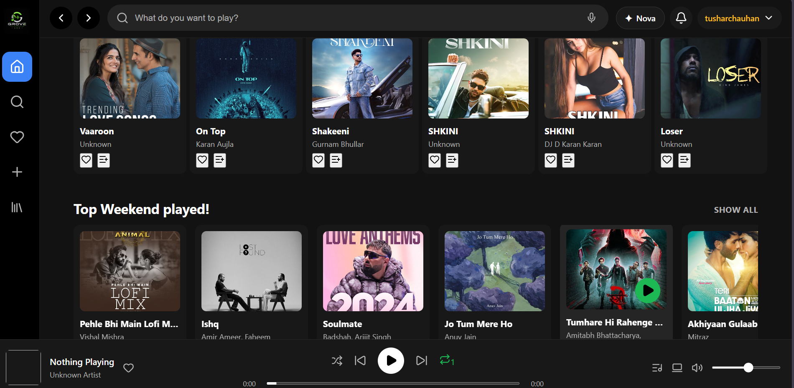
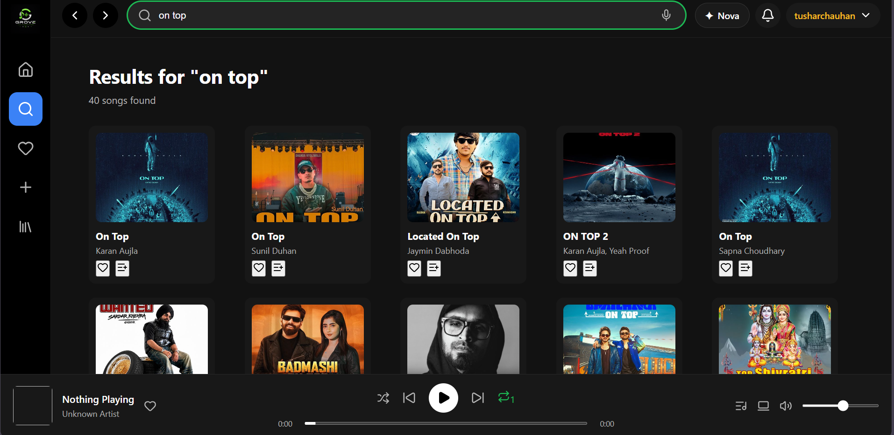
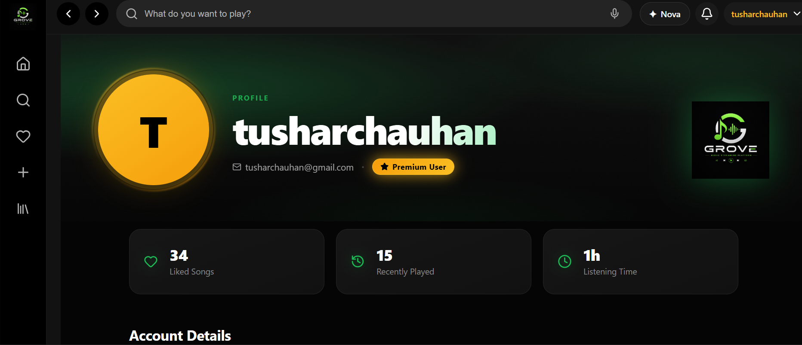
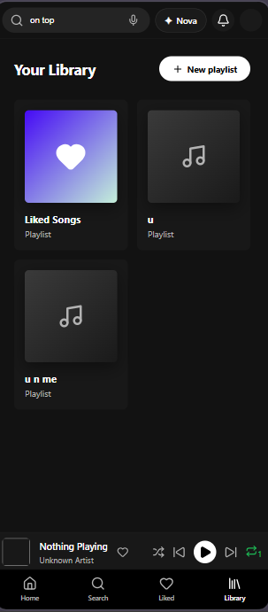
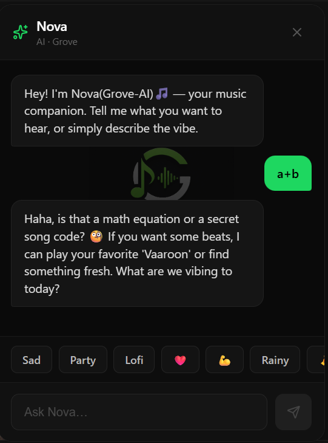
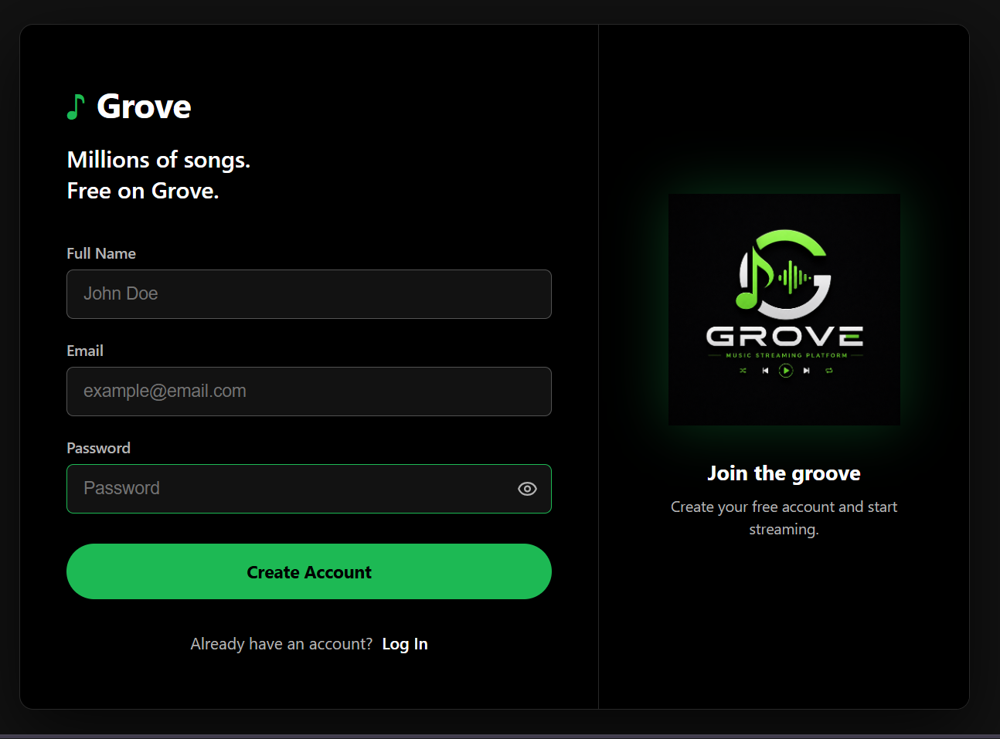

# 🎵 WAVE — AI-Powered Music Streaming Platform

<p align="center">
  
  
  
  
  
</p>

<p align="center">
  <strong>A full-stack music streaming platform with AI-powered discovery and voice-controlled playback.</strong>
</p>

<p align="center">
  <a href="https://wave-gamma-two.vercel.app/">
    🚀 Live Demo
  </a>
  &nbsp;&nbsp;•&nbsp;&nbsp;
  <a href="https://github.com/tusharchauhan89/wave">
    📂 GitHub Repository
  </a>
</p>

---

# 🌐 Live Demo

### 🚀 [Visit WAVE](https://wave-gamma-two.vercel.app/)

WAVE is a full-stack, AI-powered music streaming platform featuring music discovery, playlists, favorites, recently played history, voice-controlled playback, Grove AI, user authentication and premium listening features.

---

# 📸 Screenshots

## 🖥️ Desktop Experience

### 🏠 Home

<p align="center">
  
</p>

The WAVE home page provides a modern music discovery interface with quick access to songs, artists and personalized content.

---

### 🔎 Music Search

<p align="center">
  
</p>

Search for songs and discover music through a responsive search experience.

---

### 👤 User Profile

<p align="center">
  
</p>

Users can access their personalized profile and manage their music experience.

---

## 📱 Mobile Experience

### 🏠 Mobile Home

<p align="center">
  
</p>

WAVE provides a responsive interface that adapts to smaller screens while maintaining the core music streaming experience.

---

### 📚 Mobile Library

<p align="center">
  
</p>

Users can access saved music and their personal library from mobile devices.

---

## 🤖 Grove AI

<p align="center">
  
</p>

**Grove AI** provides an AI-powered conversational interface for music discovery and general chatbot interactions.

---

## 🔐 Authentication

<p align="center">
  
</p>

WAVE provides user authentication for personalized features and protected application functionality.

---

# ✨ Features

## 🎵 Music Discovery

* 🔎 Search for songs and artists
* 🎶 Discover music through the application
* 🖼️ Display album artwork and track information
* ▶️ Quickly start playback
* 🤖 AI-powered song discovery using Grove AI

---

## ▶️ Music Player

WAVE includes a complete music-player experience with:

* ▶️ Play
* ⏸️ Pause
* ⏭️ Next track
* ⏮️ Previous track
* 🔊 Volume control
* 📊 Playback progress
* 🎵 Track information
* 🔄 Persistent player interface

---

## 🎤 Voice Music Control

WAVE includes microphone-based voice commands for hands-free interaction with the music player.

Users can perform actions such as:

```text
🔎 Search for a song
▶️ Play a song
⏸️ Pause playback
🔊 Increase volume
🔉 Decrease volume
⏭️ Play next song
⏮️ Play previous song
```

This allows users to control their music without manually interacting with the player.

---

# 🤖 Grove AI

**Grove AI** is WAVE's integrated AI assistant.

It combines music-related assistance with general conversational chatbot capabilities.

### Grove AI can:

* 🔎 Search for songs using natural language
* 🎵 Help users discover music
* 💬 Handle general chatbot conversations
* 🧠 Understand natural-language requests
* 🎧 Assist users while listening to music
* 🎯 Help users find music based on intent

### Example Requests

```text
"Play some Arijit Singh songs"

"Find relaxing songs for studying"

"Search for workout music"

"Who sings this song?"

"Recommend songs for a road trip"

"Play something energetic"
```

---

# 🕐 Recently Played

WAVE maintains a **Recently Played** history for users.

This allows users to:

* View previously played songs
* Quickly return to tracks they recently listened to
* Maintain a personalized listening history
* Continue discovering music based on their listening activity

---

# ❤️ Favorites

Users can save songs to their personal collection.

Features include:

* ❤️ Add songs to favorites
* ❌ Remove songs from favorites
* 📚 Access favorite songs through the library

---

# 📚 Personal Library

Users have a centralized library for their saved music.

The library brings together personalized content such as:

* Favorite songs
* Playlists
* Recently played music
* Saved content

---

# 🎧 Playlists

Users can create and manage playlists to organize their music.

Playlists can be organized around:

* 🎵 Artists
* 🎼 Genres
* ❤️ Favorite tracks
* 🏋️ Activities
* 😌 Moods
* 🚗 Personal listening sessions

---

# 👤 User Profiles

Each user has a personalized profile.

User-specific functionality includes:

* Account information
* Personal library
* Favorites
* Playlists
* Recently played history
* Premium functionality

---

# 🔐 Authentication & Authorization

WAVE includes user authentication and protected backend functionality.

Authentication is used to protect personalized resources and user-specific features.

The system uses **JWT-based authorization** for protected backend operations.

---

# 💎 Premium User Features

WAVE includes a **Premium user system** based on listening activity.

After the configured listening period, users can access premium functionality designed to provide an enhanced listening experience.

The premium system demonstrates:

* 💎 Premium user status
* 🕐 Listening-time tracking
* 🔐 Feature access control
* 🛡️ Protected premium functionality
* 🔑 Backend authorization

---

# 📱 Responsive UI

WAVE is designed for both desktop and mobile experiences.

The responsive interface adapts the music-player layout and navigation to different screen sizes.

---

# 🏗️ System Architecture

```text
                         ┌─────────────────────┐
                         │       WAVE USER     │
                         └──────────┬──────────┘
                                    │
                                    ▼
                         ┌─────────────────────┐
                         │   React Frontend    │
                         │   TypeScript + Vite │
                         └──────────┬──────────┘
                                    │
                              REST API / HTTP
                                    │
                                    ▼
                         ┌─────────────────────┐
                         │   FastAPI Backend   │
                         │       Python        │
                         └──────────┬──────────┘
                                    │
             ┌──────────────────────┼──────────────────────┐
             │                      │                      │
             ▼                      ▼                      ▼
      Authentication          Music Services          Grove AI
          / JWT
             │
             ▼
       ┌───────────────┐
       │    Supabase   │
       │    Database   │
       └───────────────┘
```

---

# 🔄 How WAVE Works

### 1. User interacts with the React application

The React frontend handles:

* UI rendering
* Navigation
* Music player
* User interactions
* Application state

### 2. Frontend communicates with FastAPI

The frontend sends requests to the FastAPI backend through REST APIs.

```text
User
  ↓
React Component
  ↓
Axios / API Service
  ↓
FastAPI Endpoint
  ↓
Business Logic
  ↓
Supabase / External Services
  ↓
JSON Response
  ↓
React UI
```

### 3. Authentication

Protected requests use JWT-based authentication to determine whether a user can access personalized resources.

### 4. Music & Library

Music-related information is retrieved through the backend/service layer, while user-specific data such as favorites, playlists and recently played content is handled through the application's database.

### 5. AI & Voice Interaction

Grove AI provides conversational music assistance, while microphone-based commands allow users to control playback and search for music through voice.

---

# 🛠️ Tech Stack

## Frontend

| Technology         | Purpose                       |
| ------------------ | ----------------------------- |
| ⚛️ React           | UI development                |
| 📘 TypeScript      | Type-safe development         |
| ⚡ Vite             | Development and build tooling |
| 🧭 React Router    | Client-side routing           |
| 🔗 Axios           | API communication             |
| 🎬 Framer Motion   | UI animations                 |
| 🎨 Lucide React    | Icons                         |
| 🔔 React Hot Toast | Notifications                 |

## Backend

| Technology       | Purpose                       |
| ---------------- | ----------------------------- |
| 🐍 Python        | Backend programming           |
| ⚡ FastAPI        | REST API framework            |
| 🚀 Uvicorn       | ASGI server                   |
| 🔐 JWT           | Authentication                |
| 🗄️ Supabase     | Database and backend services |
| 📦 Pydantic      | Data validation               |
| 🌐 HTTPX         | HTTP requests                 |
| 🔑 python-dotenv | Environment configuration     |

## AI & Voice

| Technology                     | Purpose                            |
| ------------------------------ | ---------------------------------- |
| 🤖 Grove AI                    | AI assistant and music discovery   |
| 🎤 Microphone / Voice Commands | Voice-controlled music interaction |
| 💬 AI Chatbot                  | Conversational interaction         |

---

# 📁 Project Structure

```text
wave/
│
├── backend/
│   ├── routers/
│   ├── services/
│   ├── utils/
│   ├── main.py
│   ├── requirements.txt
│   └── .env
│
├── frontend-react/
│   ├── public/
│   ├── src/
│   │   ├── api/
│   │   ├── assets/
│   │   ├── components/
│   │   ├── context/
│   │   ├── hooks/
│   │   ├── pages/
│   │   ├── services/
│   │   ├── styles/
│   │   ├── types/
│   │   ├── App.tsx
│   │   └── main.tsx
│   │
│   ├── package.json
│   ├── vite.config.ts
│   └── tsconfig.json
│
├── sceenshots/
│   ├── home-desktop.png
│   ├── home-mobile.png
│   ├── home1.png
│   ├── library-mobile.png
│   ├── nova-ai.png
│   ├── search.png
│   ├── signup.png
│   └── user-profile.png
│
├── README.md
└── package.json
```

> **Note:** The `sceenshots` directory contains images used only for project documentation and does not affect the application's backend or frontend deployment.

---

# ⚙️ Getting Started

## Prerequisites

Make sure you have installed:

* Node.js
* npm
* Python 3.10+
* Git
* Supabase account

---

# 1️⃣ Clone the Repository

```bash
git clone https://github.com/tusharchauhan89/wave.git

cd wave
```

---

# 🐍 Backend Setup

Navigate to the backend:

```bash
cd backend
```

Create a virtual environment:

```bash
python -m venv venv
```

### Windows

```bash
venv\Scripts\activate
```

### macOS / Linux

```bash
source venv/bin/activate
```

Install dependencies:

```bash
pip install -r requirements.txt
```

---

# 🔐 Environment Variables

Create a `.env` file inside the backend directory.

```env
SUPABASE_URL=your_supabase_url
SUPABASE_KEY=your_supabase_key
JWT_SECRET=your_jwt_secret
```

> ⚠️ Never commit real API keys, database credentials or secrets to GitHub.

For production deployments, configure environment variables directly through your hosting platform.

---

# ▶️ Start the Backend

Run:

```bash
uvicorn main:app --reload
```

The backend will be available at:

```text
http://127.0.0.1:8000
```

FastAPI interactive documentation:

```text
http://127.0.0.1:8000/docs
```

---

# ⚛️ Frontend Setup

Open another terminal and navigate to:

```bash
cd frontend-react
```

Install dependencies:

```bash
npm install
```

Start the development server:

```bash
npm run dev
```

Vite will display the local development URL in the terminal.

---

# 🧪 Production Build

Build the frontend:

```bash
npm run build
```

Preview the production build:

```bash
npm run preview
```

---

# 🚀 Deployment

## Frontend

The WAVE frontend is deployed using **Vercel**.

### 🌐 Live Application

**https://wave-gamma-two.vercel.app/**

## Backend

The FastAPI backend can be deployed separately using a backend hosting platform such as Render.

The frontend communicates with the deployed backend through API endpoints configured using environment variables.

---

# 🎯 What I Learned

Building WAVE provided practical experience with:

* Full-stack web application architecture
* React component development
* TypeScript
* REST API development
* FastAPI
* Python backend development
* Authentication and authorization
* JWT
* Supabase
* API integration
* Frontend state management
* Responsive UI design
* AI integration
* Voice-controlled application features
* Listening-history management
* Premium feature access control
* Error handling
* Git & GitHub
* Vercel deployment
* Backend deployment

---

# 🔮 Future Improvements

The core music streaming, AI, voice-control, listening-history and premium functionality is already implemented.

Future development will focus on improving and scaling the existing platform.

* [ ] More personalized AI music recommendations
* [ ] Improved natural-language understanding for Grove AI
* [ ] More advanced listening-based recommendations
* [ ] Improved voice recognition accuracy
* [ ] Enhanced artist and album pages
* [ ] Better streaming performance and caching
* [ ] Progressive Web App support
* [ ] Additional premium plans and subscription options
* [ ] Enhanced listening analytics
* [ ] Further mobile and accessibility improvements

---

# 👨‍💻 Author

## Tushar Chauhan

**B.Tech — Computer Science & Engineering**

### Connect with me

* 🐙 GitHub: [@tusharchauhan89](https://github.com/tusharchauhan89)
* 📂 Project: [WAVE Repository](https://github.com/tusharchauhan89/wave)
* 🚀 Live Demo: [WAVE](https://wave-gamma-two.vercel.app/)

---

# ⭐ Show Your Support

If you like this project, consider giving the repository a ⭐ on GitHub.

---

<p align="center">
  Built with ❤️ using React, TypeScript, FastAPI and Supabase.
</p>
