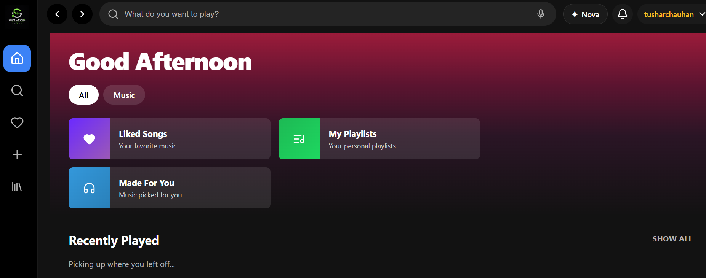

# 🎵 WAVE

### AI-Powered Music Streaming Platform

<p align="center">
  
  
  
  
  
</p>

<p align="center">
  A modern full-stack music platform with <b>Grove AI</b>, voice-controlled playback,
  personalized libraries and premium features.
</p>

<p align="center">
  <a href="https://wave-gamma-two.vercel.app/">🌐 Live Demo</a>
  &nbsp; · &nbsp;
  <a href="https://github.com/tusharchauhan89/wave">💻 GitHub</a>
</p>

---

## ✨ Features

| 🎵 Music          | 🤖 AI            | 🎤 Voice       | 💎 Personal     |
| ----------------- | ---------------- | -------------- | --------------- |
| Search & playback | Grove AI         | Song search    | Favorites       |
| Playlists         | AI chatbot       | Play / pause   | Recently played |
| Library           | Music discovery  | Volume control | User profiles   |
| Next / previous   | Natural language | Track controls | Premium access  |

### 🎤 Voice Control

Control your music hands-free:

`Search` · `Play` · `Pause` · `Next` · `Previous` · `Volume Up` · `Volume Down`

### 🤖 Grove AI

Grove AI combines **music discovery with a conversational chatbot**, allowing users to search for music naturally and interact with an AI assistant.

### 💎 Premium

Premium functionality is unlocked based on **listening activity**, with protected feature access and backend authorization.

---

# 📸 Preview

### 🖥️ Desktop

<p align="center">
  
</p>

<p align="center">
  
</p>

### 🔎 Search

<p align="center">
  
</p>

### 👤 Profile

<p align="center">
  
</p>

### 🤖 Grove AI

<p align="center">
  
</p>

### 📱 Mobile

<p align="center">
  
  &nbsp;&nbsp;&nbsp;
  
</p>

### 🔐 Authentication

<p align="center">
  
</p>

---

# 🛠️ Tech Stack

### Frontend

**React · TypeScript · Vite · React Router · Axios · Framer Motion · Lucide React**

### Backend

**Python · FastAPI · Uvicorn · Pydantic · JWT · HTTPX**

### Database & Services

**Supabase · REST APIs · AI Services · Voice Commands**

---

# 🏗️ Architecture

```text
              ┌──────────────┐
              │    WAVE      │
              │     User     │
              └──────┬───────┘
                     │
                     ▼
          ┌─────────────────────┐
          │   React + Vite      │
          │     Frontend        │
          └──────────┬──────────┘
                     │
                  REST API
                     │
                     ▼
          ┌─────────────────────┐
          │      FastAPI        │
          │      Backend        │
          └──────┬──────┬───────┘
                 │      │
          ┌──────▼─┐  ┌─▼────────┐
          │Supabase│  │ Grove AI │
          └────────┘  └──────────┘
```

---

# 📁 Structure

```text
wave/
├── backend/
│   ├── routers/
│   ├── services/
│   ├── utils/
│   ├── main.py
│   └── requirements.txt
│
├── frontend-react/
│   ├── src/
│   │   ├── components/
│   │   ├── pages/
│   │   ├── services/
│   │   ├── context/
│   │   └── hooks/
│   └── package.json
│
├── sceenshots/
│   ├── home-desktop.png
│   ├── home-mobile.png
│   ├── home1.png
│   ├── library-mobile.png
│   ├── nova-ai.png
│   ├── search.png
│   ├── signup.png
│   └── user-profile.png
│
└── README.md
```

---

# ⚙️ Run Locally

### 1. Clone

```bash
git clone https://github.com/tusharchauhan89/wave.git
cd wave
```

### 2. Backend

```bash
cd backend

python -m venv venv

# Windows
venv\Scripts\activate

pip install -r requirements.txt

uvicorn main:app --reload
```

### 3. Frontend

```bash
cd frontend-react
npm install
npm run dev
```

### 4. Environment

Create `backend/.env`:

```env
SUPABASE_URL=your_supabase_url
SUPABASE_KEY=your_supabase_key
JWT_SECRET=your_jwt_secret
```

> 🔒 Never commit real credentials or API keys.

---

# 🚀 Deployment

**Frontend:** Vercel
**Backend:** Render
**Database:** Supabase

🌐 **Live:** https://wave-gamma-two.vercel.app/

---

# 👨‍💻 Team

### Tushar Chauhan,Sahil Chauhan

B.Tech — Computer Science & Engineering

🐙 [GitHub](https://github.com/tusharchauhan89)

### Sahil Chauhan

🐙 [GitHub](https://github.com/iksahil-hub)

---

<p align="center">

### ⭐ If you like WAVE, consider starring the repository.

**Built with ❤️ using React, TypeScript, FastAPI & Supabase.**

</p>
